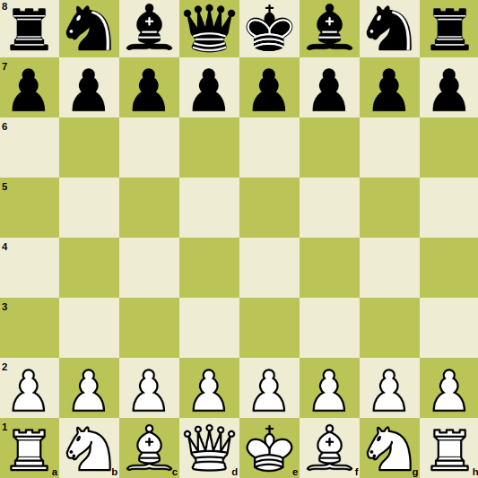
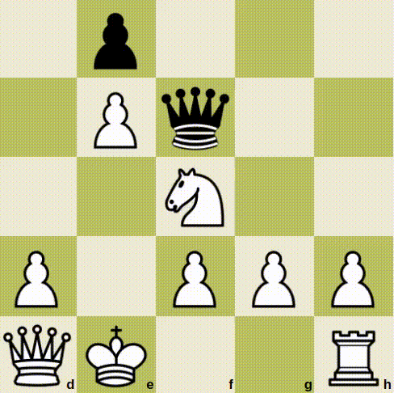
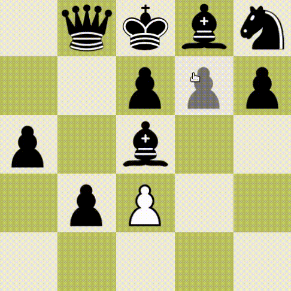
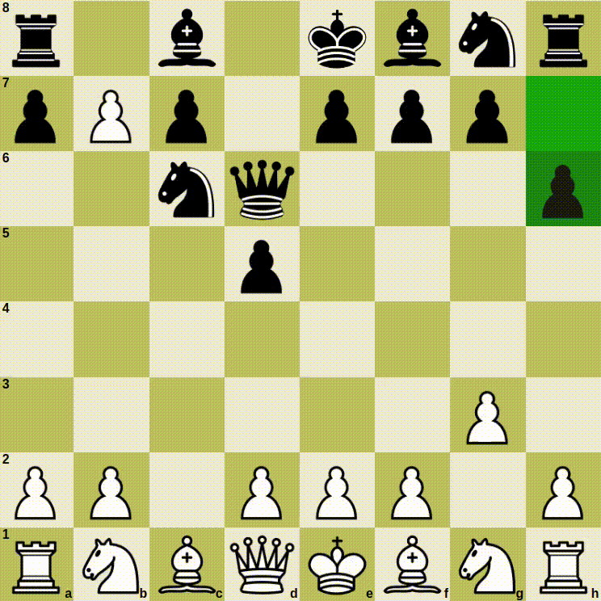
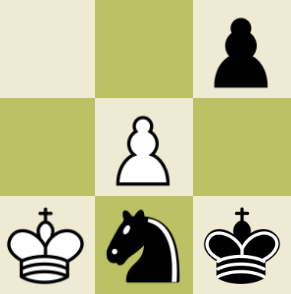
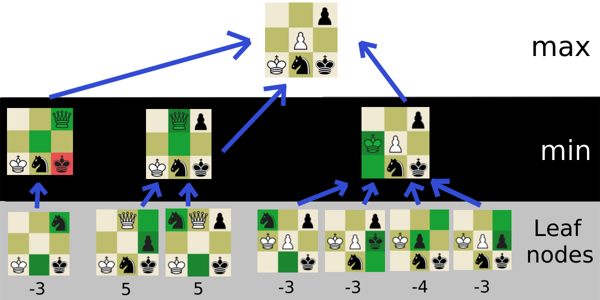
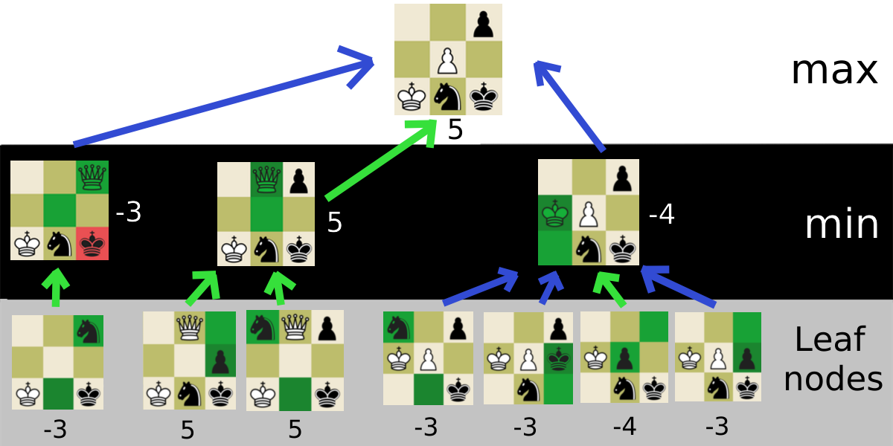

# Chess with AI

Play the game: https://aaronhe7.github.io/chess/

This is the entire game of chess programmed using HTML, CSS, and JavaScript, including special moves and detecting draws. This game is made using object-oriented programming, where all the rules and logic are implemented using classes and methods. In the game, players can only make legal moves, and whenever a winner or draw is detected, it is automatically announced.   

Additionally, I created an AI that plays logically using a recursive algorithm called minimax. The computer searches the game tree to a depth of 2 and decides what the best move is based on what the board will end up like if it makes that move.

Here is a video of the algorithm playing against itself:  
https://youtu.be/vxkWigzvVZg

## Table of Contents
* [ Special Moves ](#special-moves)
* [ Minimax algorithm ](#minimax)
  * [ How it works ](#minimax-explanation)
  * [ What it can do ](#what-it-can-do)

## Special Moves
Here are some lesser known moves in chess I implemented.  

**Castling**  
Castling occurs when a king moves two spaces to either the left or the right, and the rook crosses over the king. Castling is possible if there are no pieces between the chosen rook and king, and if the king does not move out of, into, or through a check.

***
**En passant**  
En passant is a move that a pawn can make when an opposing pawn makes a double move and ends up adjacent to the current pawn, where the opposing pawn can be captured as if it moved one square forward. The right to en passant is lost after one turn.

***
**Pawn promotion**  
When a pawn moves to the player's final rank, the pawn can change to either a queen, rook, bishop, or knight.

***

## Minimax algorithm  
The minimax algorithm seeks to find an optimal move, assuming the opponent will also use the minimax algorithm to find a move. The minimax algorithm cannot search the entire game tree, so it is limited to a certain depth. Once the depth reaches its limit, the program evaluates the board state, by assigning a value to each type of piece.

### How it works
Consider this 3x3 chess board with white to move. Assume if a pawn moves to the last rank, it will get promoted to a queen.

In this board state, there are three possible moves for white:

* Move the king up one square
* Move the pawn up one square
* Capture the black pawn on the top right

My thought process for this is to think about each move, and what the opponent would do in return.

If I moved the king up, my opponent would capture the white pawn, so I immedietely discard that solution. Taking the pawn on the top right would promote the white pawn into a queen, however my opponent would capture it with his knight on the next turn. 

The final move to consider is to move the pawn up a tile. The pawn would be promoted to a queen, and there would be no possible way for my opponent to capture it. Therefore, I come to the conclusion that moving the pawn up is the best solution.

This is basically what a minimax algorithm does, but it uses numbers to compare moves and choose the best one.

Here is a diagram to demonstrate what this algorithm does at depth 2:

At the maximum depth, a score is given to a board in what is called a leaf node. At this stage, all board pieces are given a value. Since the algorithm is playing white, the board state is the value of all white pieces minus the value of all black pieces. The algorithm does not calculate every single leaf node before the values are returned to higher levels, but the point is that all values in higher levels are inherited from leaf nodes.

Board states that are terminal, i.e., a win or a draw, are also leaf nodes, even if the depth is higher. It will return an extremely high score if the winner is the computer, zero if there is a draw, and a low score if the winner is the other player. In this case there are none.

How values are given to each piece is subjective, but here are the piece ratings I used for this example:

| Pawn | Knight | Bishop | Rook | Queen | King |
|------|--------|--------|------|-------|------|
| 1    | 3      | 3      | 5    | 9     | 100  |

The value of the bottom left node is $-3$ since $(100) - (100 + 3) = -3$.

***
After scores are evaluated from the leaf nodes, each score is passed up one level. Since the level above the leaf nodes is black's turn, the algorithm will take the minimum of all the scores passed up. This is because black's optimal move is the move which will harm white the most, and give the lowest score.

Finally, the algorithm passes the nodes to the next top level, and return the node with the best score.

Here is the final diagram:

The final move that was returned happened to be the move I initially assumed was the best. Since my chess algorithm only uses a depth 2 minimax search, the algorithm occasionally does a illogical move. This problem can be solved by increasing the depth, but at the cost of time. If the depth was higher, the levels would alternate taking the maximum value and the minimum value of the board state, depending on which player is moving.

### What it can do
This algorithm can show some ressemblence to what humans think when they play chess. Here are some of its actions that it can take:
* Move pieces into reasonable positions
* Capture a piece that is out in the open
* Move a piece that is being attacked out of the way
* Spot a winning move
* Trade weaker pieces for stronger ones
